# 🕵️ Steganography — Hidden Data Toolkit


> **A practical, hands-on reference covering image, audio, and metadata steganography — including detection and steganalysis techniques — using industry-relevant tools across Linux and Windows environments.**

---

## 📖 What is Steganography?

Steganography is the art of hiding information in plain sight. Unlike cryptography (which scrambles data), steganography **conceals the very existence** of the message — embedding it inside innocent-looking carrier files such as images, audio, or video. Only someone who knows the hidden data is there, and has the right tool or passphrase, can retrieve it.

This toolkit documents practical techniques using real tools, real carrier files, and real extracted output — making it useful for:

- 🎓 Security students and researchers
- 🔍 Digital forensics and incident responders  
- 🛡️ CTF (Capture the Flag) participants
- 🧪 Red team / Blue team practitioners

---

## 🗂️ Repository Structure

```
Steganography-HiddenData-Toolkit/
├── README.md
└── screenshots/
    ├── task1_steghide_embed.png
    ├── task1_steghide_extract.png
    ├── task1_steghide_info.png
    ├── task1_stegosuite_embed.png
    ├── task1_stegosuite_extract.png
    ├── task2_winrar_content.png
    ├── task3_bat_execution.png
    ├── task4_deepsound_encode.png
    ├── task4_deepsound_extract.png
    ├── task4_deepsound_github.png
    ├── task5_aperisolve_exiftool.png
    ├── task5_aperisolve_foremost.png
    ├── task5_aperisolve_strings.png
    ├── task5_aperisolve_upload.png
    ├── task5_aperisolve_zsteg.png
    ├── task5_exiftool_embed.png
    ├── task5_exiftool_extract.png
    ├── task5_openstego_gui.png
    ├── task5_silenteye_encode.png
    ├── task5_spectrumseal_decode.png
    ├── task5_spectrumseal_encode.png
    ├── task5_steg_encode.png
    └── task5_stegseek_extract.png
```

---

## 🧰 Techniques & Tools Covered

| # | Technique | Tool(s) Used | Platform |
|---|-----------|-------------|----------|
| 1 | JPEG Image Steganography | Steghide, Stegosuite, StegSeek | Linux |
| 2 | SFX Archive Hidden in Image | WinRAR | Windows |
| 3 | Executable Payload in Image | WinRAR SFX + Batch File | Windows |
| 4 | Audio Steganography | DeepSound | Windows |
| 5 | LSB Image Steganography | SpectrumSeal, SilentEye, OpenStego | Windows |
| 5 | Metadata Steganography | ExifTool | Linux |
| 6 | Steganalysis & Detection | Aperi'Solve, Binwalk, Zsteg, Steg | Linux / Online |

---

## 🔬 Technique 1 — JPEG Steganography with Steghide & Stegosuite

**Steghide** uses Rijndael-128 CBC encryption to hide files inside JPEG/BMP images. **Stegosuite** provides an AES-based alternative with both GUI and CLI modes.

### Steghide — Inspect & Extract

```bash
# Check if a file has hidden data
steghide --info gift.jpeg

# Extract hidden file (prompts for passphrase)
steghide --extract -sf gift.jpeg
```

**Output:** `gift.jpeg` revealed an embedded `Secret.txt` (31 bytes), encrypted with Rijndael-128 CBC.

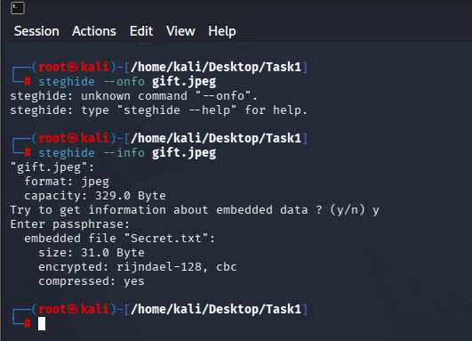
*Steghide inspecting gift.jpeg — confirms embedded Secret.txt, encryption scheme, and compression*

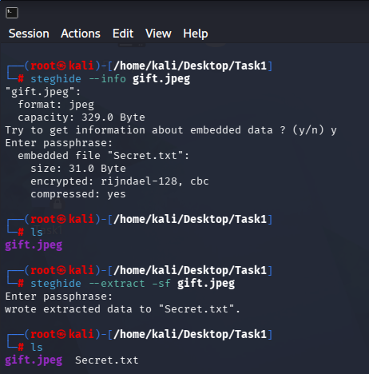
*Steghide successfully extracting the hidden file with the correct passphrase*

### Stegosuite — Embed & Extract

```bash
# Embed secret.txt into flower.jpg with key
stegosuite embed -k 123456 -f secret.txt flower.jpg

# Check capacity of output image
stegosuite capacity flower_embed.jpg

# Extract hidden data
stegosuite extract flower_embed.jpg -k 123456
```

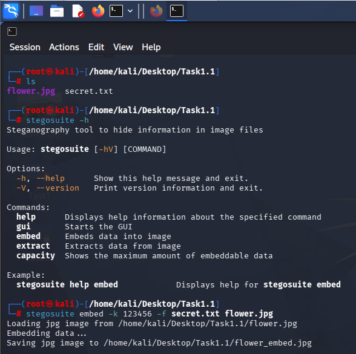
*Stegosuite embedding secret.txt into flower.jpg — output saved as flower_embed.jpg*

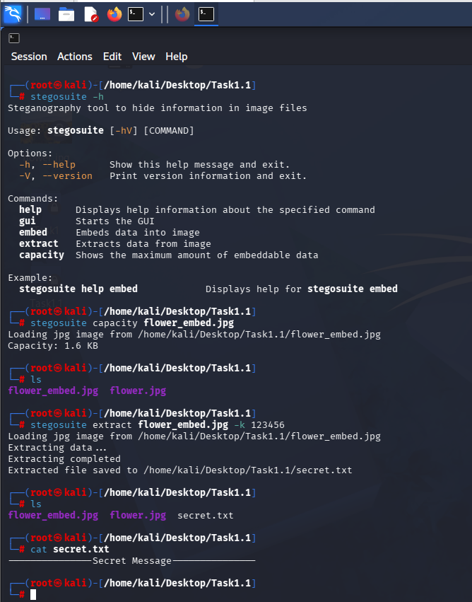
*Stegosuite extracting the hidden file from flower_embed.jpg — Secret Message recovered*

### StegSeek — Fast Passphrase Brute-Force

```bash
# Brute-force extract using known/wordlist passphrase
stegseek flower.jpg --passphrase 123456
```

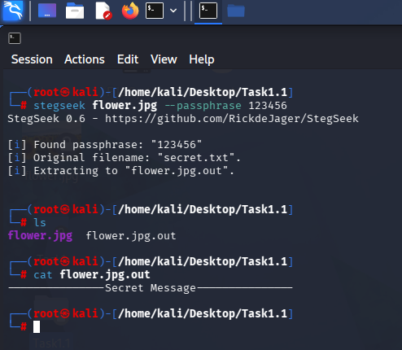
*StegSeek finding passphrase "123456" and extracting the original secret.txt*

**Alternative Tools:**
- [OutGuess](https://github.com/resurrecting-open-source-projects/outguess) — Redundant JPEG steganography
- [F5](https://github.com/jackfengji/f5-steganography) — Matrix encoding for high-capacity JPEG stego

---

## 🗜️ Technique 2 — SFX Archive Appended to JPEG (WinRAR)

WinRAR can create a **Self-Extracting (SFX) archive** and append it to the tail of a JPEG file. The image displays normally in any viewer but opens as an archive when accessed with WinRAR — revealing hidden files inside.

### How It Works

1. Create a RAR SFX archive containing your secret file
2. In WinRAR: `Tools → SFX Options` — set autorun behavior if needed
3. The output `.jpg` file is both a valid image and a valid archive

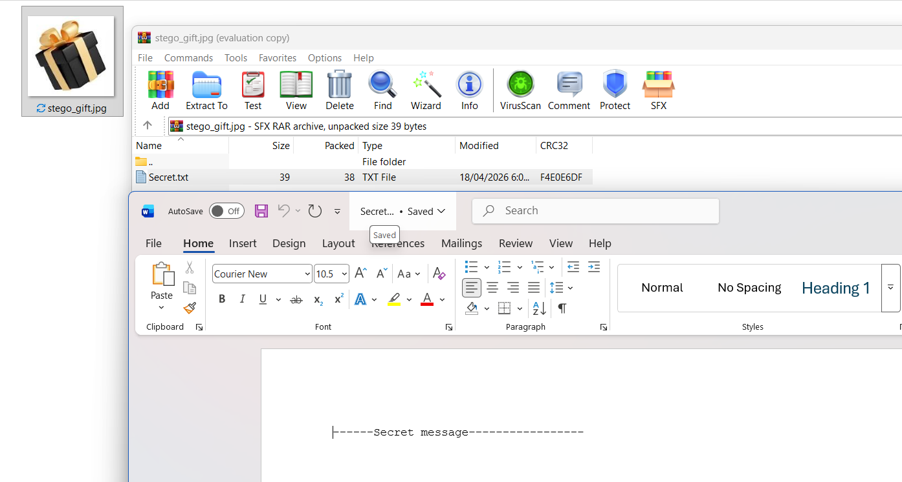
*WinRAR opening stego_gift.jpg — reveals SFX archive containing Secret.txt (39 bytes)*

**Recovered content:** `------Secret message----------------`

**Alternative Tools:**
- [7-Zip SFX](https://www.7-zip.org/) — Open-source SFX archive creation
- [NSIS](https://nsis.sourceforge.io/) — Advanced installer/extractor framework

---

## 💥 Technique 3 — Hiding & Auto-Executing a Batch File via WinRAR

An executable `.bat` file was embedded inside a JPEG using WinRAR SFX with an **autorun configuration**. When the stego image file is executed, the batch file runs its commands automatically — no manual extraction needed.

### Steps

1. Create your `.bat` payload file
2. In WinRAR SFX options: set `Run after extraction` → `test.bat`
3. Save as `.jpg` — the file is both a valid image and a self-executing archive

```batch
@echo off
echo Task 3: Steganography Successful!
echo Batch file is running from the image.
pause
```

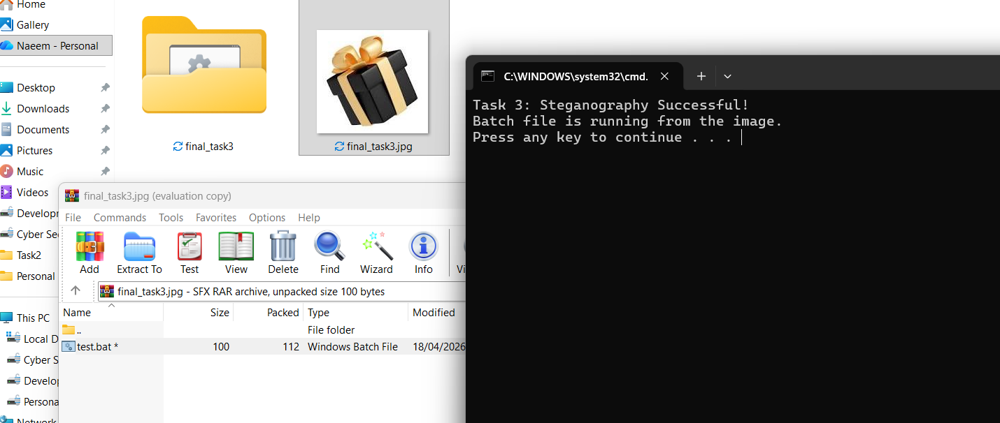
*final_task3.jpg executed — CMD window confirms "Task 3: Steganography Successful! Batch file is running from the image."*

> ⚠️ **Note:** This technique is used in real-world malware delivery. Understanding it is essential for defensive security and incident response.

**Alternative Tools:**
- [NSIS](https://nsis.sourceforge.io/) — Supports silent extraction and execution
- [7-Zip SFX](https://www.7-zip.org/) — Supports custom SFX modules with run commands

---

## 🎵 Technique 4 — Audio Steganography with DeepSound

**DeepSound** hides secret files inside MP3/WAV audio carriers using **AES-256 encryption**. The output audio file sounds and plays identically to the original.

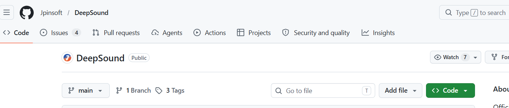
*DeepSound repository on GitHub (Jpinsoft/DeepSound)*

### Encode (Hide Data)

1. Open DeepSound → **Open carrier files** → load your MP3
2. **Add secret files** → select `Secret.txt`
3. Click **Encode secret files** → enable AES-256, set password, choose WAV output

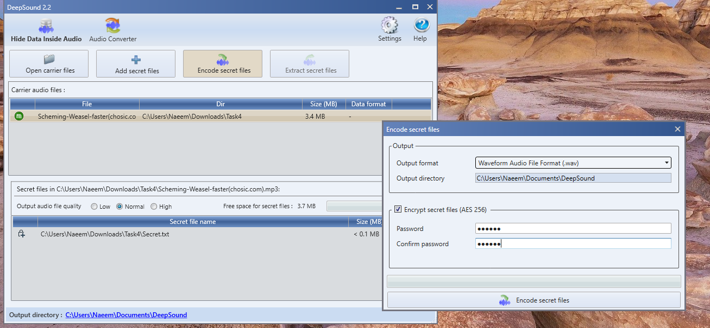
*DeepSound encoding Secret.txt into an MP3 carrier with AES-256 encryption*

### Decode (Extract Data)

1. Open DeepSound → **Open carrier files** → load the encoded WAV
2. Click **Extract secret files** → enter password

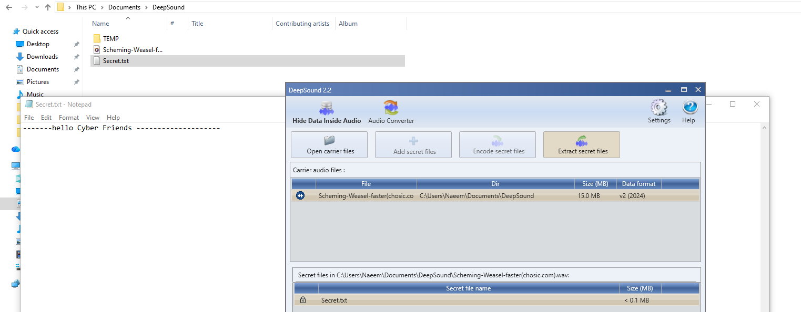
*DeepSound extracting Secret.txt from the encoded WAV — content: "------hello Cyber Friends -------------------"*

**Alternative Tools:**
- [MP3Stego](https://www.petitcolas.net/steganography/mp3stego/) — Hides data in MP3 during compression
- [HiddenWave](https://github.com/techchipnet/HiddenWave) — Python LSB steganography for WAV files
- [Coagula](http://www.abc.se/~re/Coagula/Coagula.html) — Encodes images into audio spectrograms

---

## 🖼️ Technique 5 — Image Steganography: LSB, Metadata & GUI Tools

### SpectrumSeal — Online LSB Steganography

[SpectrumSeal](https://spectrumseal.com) uses **LSB (Least Significant Bit)** encoding to hide files directly in image pixel data.

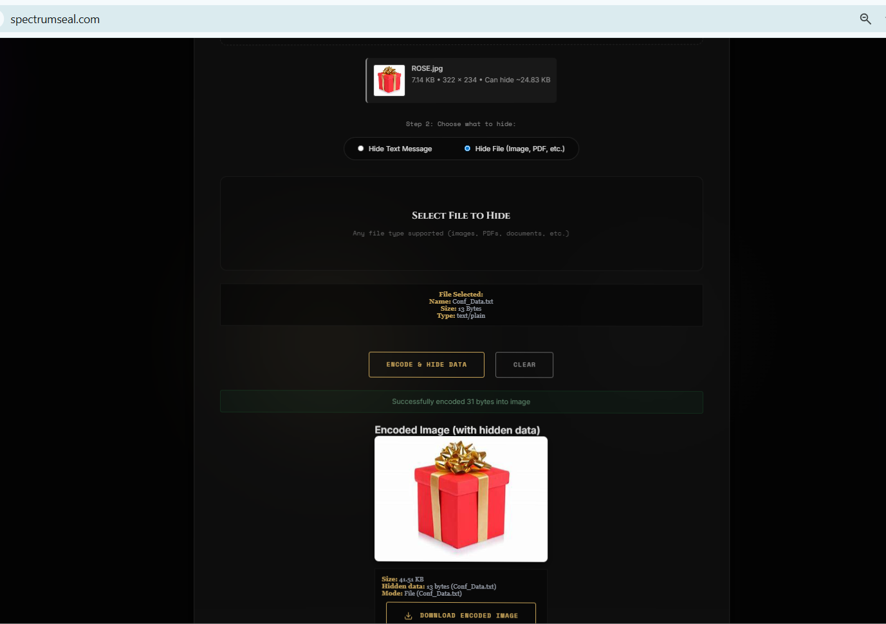
*SpectrumSeal encoding Conf_Data.txt into encoded_image.png*

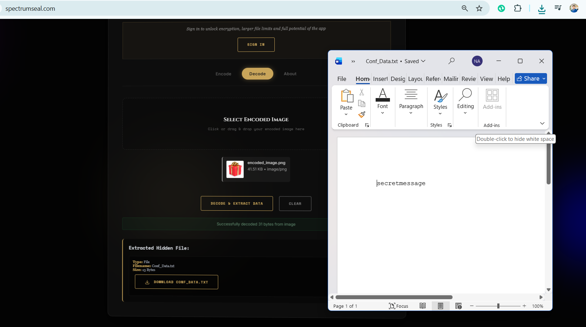
*SpectrumSeal decoding — successfully extracted 31 bytes; content: "secretmessage"*

---

### Steg Tool

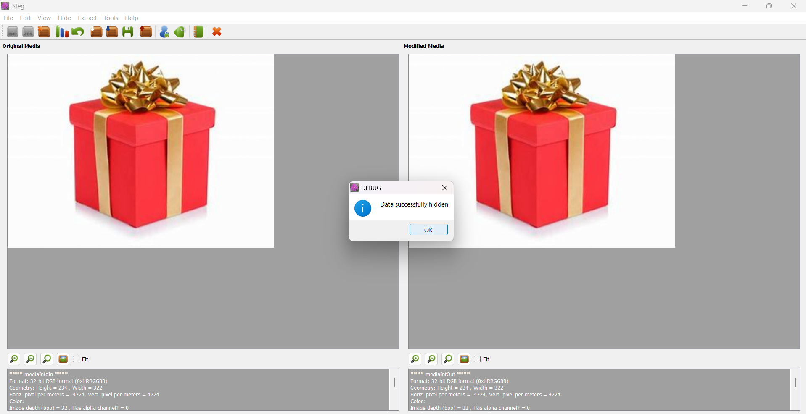
*Steg tool used for embedding data into image carrier*

---

### ExifTool — Metadata Steganography

**ExifTool** embeds secret data inside image **metadata fields** (e.g., Comment, Artist, Copyright) — invisible to the naked eye, readable only with ExifTool.

```bash
# Embed secret message in JPEG Comment metadata
exiftool -Comment="secret Message." flower.jpg

# Verify it was written
exiftool flower.jpg | grep Comment

# Extract and save to file
exiftool -s3 -Comment flower.jpg > extracted_secret.txt

# Read extracted content
cat extracted_secret.txt
```

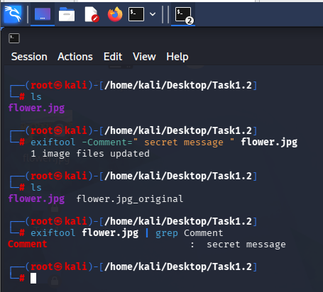
*ExifTool writing "secret message" to the Comment metadata field of flower.jpg*

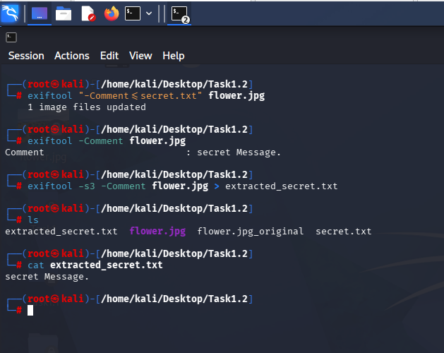
*ExifTool extracting the Comment field — secret Message. recovered to extracted_secret.txt*

---

### SilentEye — GUI Steganography (Image & Audio)

**SilentEye** provides a graphical interface for encoding messages in JPEG images and WAV audio, with optional AES encryption and compression.

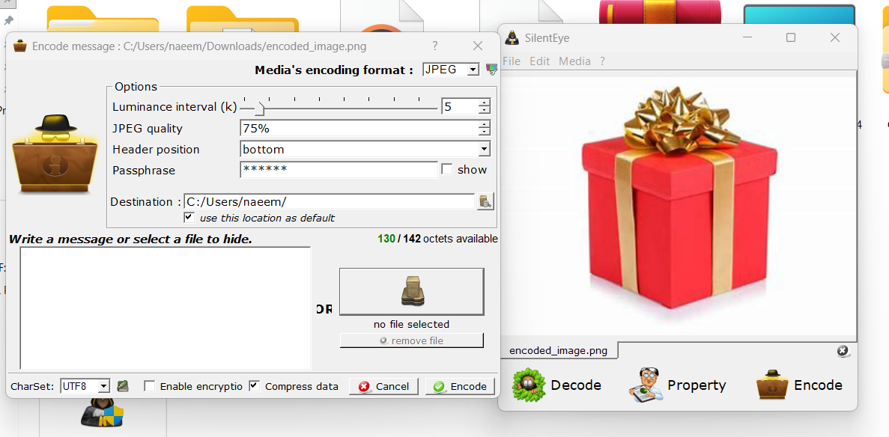
*SilentEye encoding dialog — JPEG format, AES passphrase, 75% quality, header position: bottom*

---

### OpenStego — Data Hiding + Watermarking

**OpenStego** supports both data hiding (LSB) and digital watermarking with AES128 encryption.

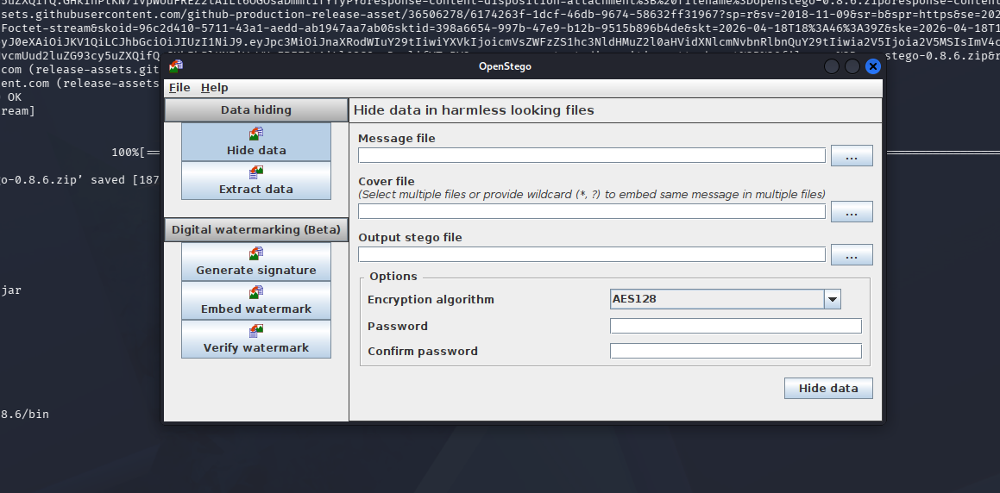
*OpenStego GUI — Hide Data panel with AES128 encryption and password options*

---

**Alternative Tools:**
- [Zsteg](https://github.com/zed-0xff/zsteg) — Detects LSB data in PNG/BMP across all bit planes
- [Stegsolve](https://github.com/eugenekolo/sec-tools/tree/master/stego/stegsolve) — Java-based visual channel analyzer
- [Binwalk](https://github.com/ReFirmLabs/binwalk) — Detects embedded file signatures in binary data
- [Foremost](http://foremost.sourceforge.net/) — File carving for recovering embedded content

---

## 🔎 Technique 6 — Steganalysis: Detecting Hidden Data

**Steganalysis** is the defensive counterpart — detecting whether a file carries hidden data, and which tool was used.

### Aperi'Solve — Automated Multi-Tool Analysis Platform

[Aperi'Solve](https://www.aperisolve.fr) runs a full suite of detection tools in one upload:

| Tool | What It Checks |
|------|---------------|
| ExifTool | Metadata anomalies and suspicious fields |
| Binwalk | Embedded file signatures and magic bytes |
| Foremost | File carving for hidden embedded content |
| Pngcheck | PNG chunk structure integrity validation |
| Zsteg | LSB data across all RGB bit planes |
| Steghide | Passphrase-based extraction attempt |
| Jsteg / Jpseek | JPEG-specific steganography patterns |
| Strings | Readable ASCII fragments in binary data |

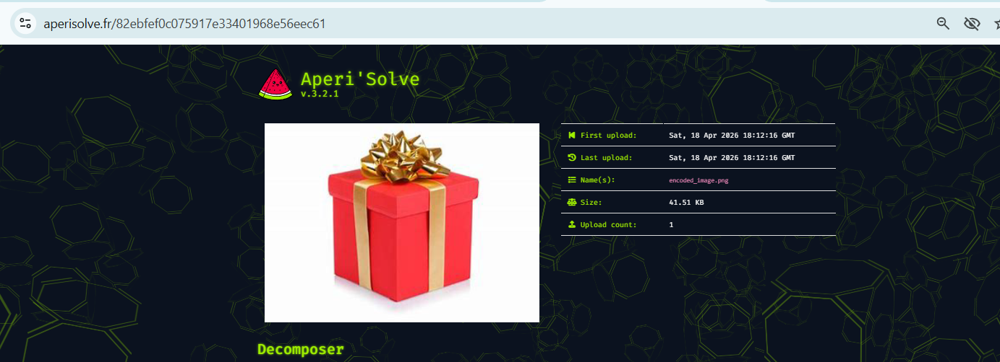
*Aperi'Solve: encoded_image.png (41.51 KB) uploaded for analysis*

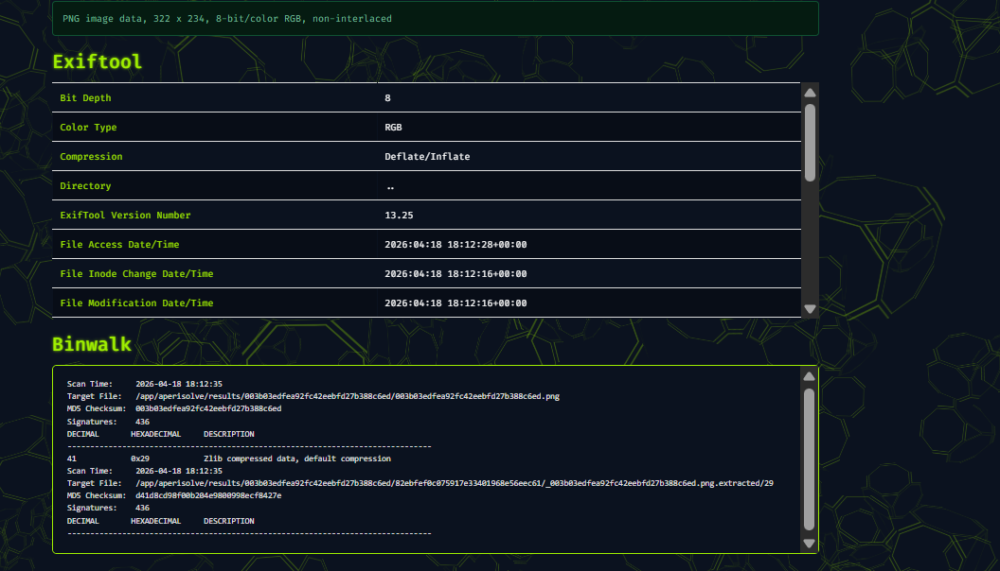
*ExifTool metadata scan + Binwalk detecting Zlib compressed data at offset 0x29*

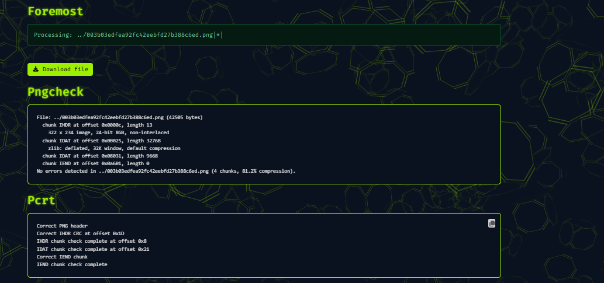
*Foremost file carving results + Pngcheck validating 4 PNG chunks at 81.2% compression*

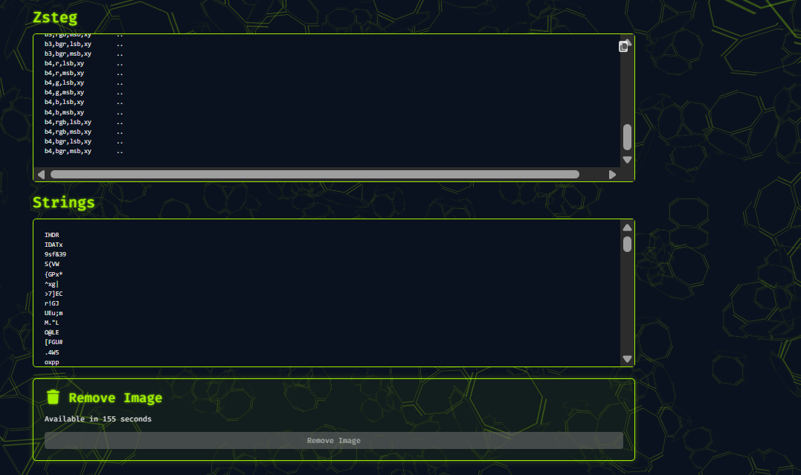
*Strings tool extracting readable ASCII fragments from binary — confirms embedded content*

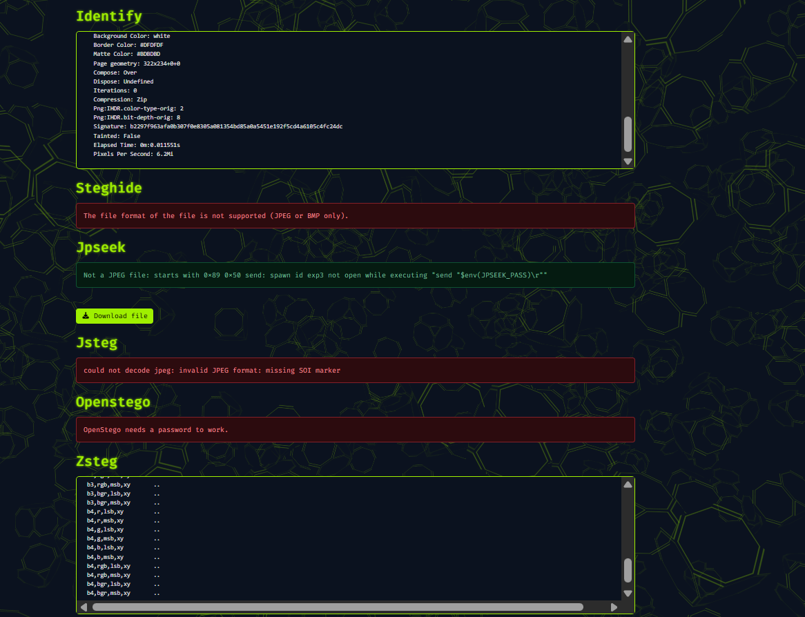
*Zsteg scanning b1–b4 bit planes across rgb/bgr channels (lsb/msb) for LSB-encoded data*

**Key findings on `encoded_image.png`:**
-  Binwalk flagged Zlib compressed data at `0x29`
-  Pngcheck validated structure — 4 chunks, 81.2% compression
-  OpenStego flagged password requirement — confirming hidden data present
-  Zsteg scanned all bit planes — LSB artifacts detected


**Alternative Steganalysis Tools:**
- [Stegdetect](https://github.com/abeluck/stegdetect) — Statistical JPEG steganalysis
- [StegExpose](https://github.com/b3dk7/StegExpose) — Batch LSB detection for PNG/BMP
- [StegoVeritas](https://github.com/bannsec/stegoVeritas) — Python multi-technique steganalysis
- [HxD](https://mh-nexus.de/en/hxd/) / [xxd](https://linux.die.net/man/1/xxd) — Manual hex inspection for appended data

---

## 📥 Tool Download Links

| Tool | Platform | Download |
|------|----------|----------|
| **Steghide** | Linux | `sudo apt install steghide` |
| **Stegosuite** | Linux | `sudo apt install stegosuite` |
| **StegSeek** | Linux | [github.com/RickdeJager/StegSeek](https://github.com/RickdeJager/StegSeek) |
| **WinRAR** | Windows | [rarlab.com](https://www.rarlab.com/download.htm) |
| **DeepSound** | Windows | [jpinsoft.net](http://jpinsoft.net/DeepSound/Download.aspx) |
| **SpectrumSeal** | Online | [spectrumseal.com](https://spectrumseal.com) |
| **SilentEye** | Windows/Linux | [github.com/achorein/silenteye](https://github.com/achorein/silenteye) |
| **OpenStego** | Windows/Linux | [openstego.com](https://www.openstego.com/) |
| **ExifTool** | Linux/Windows | [exiftool.org](https://exiftool.org/) |
| **Binwalk** | Linux | `sudo apt install binwalk` |
| **Zsteg** | Linux | `gem install zsteg` |
| **Aperi'Solve** | Online | [aperisolve.fr](https://www.aperisolve.fr) |
| **Stegsolve** | Linux/Windows | [github.com/eugenekolo/sec-tools](https://github.com/eugenekolo/sec-tools/tree/master/stego/stegsolve) |
| **OutGuess** | Linux | `sudo apt install outguess` |
| **Foremost** | Linux | `sudo apt install foremost` |
| **MP3Stego** | Windows/Linux | [petitcolas.net](https://www.petitcolas.net/steganography/mp3stego/) |
| **HiddenWave** | Linux | [github.com/techchipnet/HiddenWave](https://github.com/techchipnet/HiddenWave) |
| **Stegdetect** | Linux | [github.com/abeluck/stegdetect](https://github.com/abeluck/stegdetect) |
| **StegoVeritas** | Linux | `pip install stegoveritas` |
| **StegExpose** | Linux/Windows | [github.com/b3dk7/StegExpose](https://github.com/b3dk7/StegExpose) |


---

## 🔑 Key Concepts

| Term | Definition |
|------|-----------|
| **Steganography** | Hiding data inside a carrier file so its existence is undetected |
| **Steganalysis** | Detecting whether a file contains hidden embedded data |
| **LSB Encoding** | Modifying the least significant bits of pixel values to encode data |
| **SFX Archive** | Self-extracting archive — can be appended to image files |
| **Carrier File** | The innocent-looking host file (image, audio, video) |
| **Stego File** | A carrier file that contains hidden embedded data |
| **Passphrase** | Password used to encrypt/lock the hidden data |
| **Metadata Stego** | Hiding data inside file metadata fields (EXIF, Comment, etc.) |

---

## **Connect with me**
[**Naeem Akmal on LinkedIn**](https://www.linkedin.com/in/naeemakmal15)

---

## ⭐ Star this repo if you found it useful!

